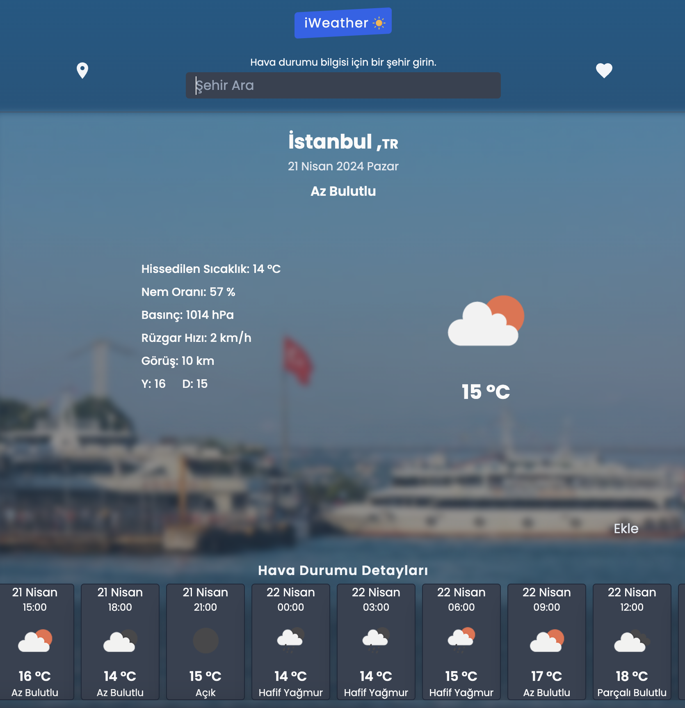
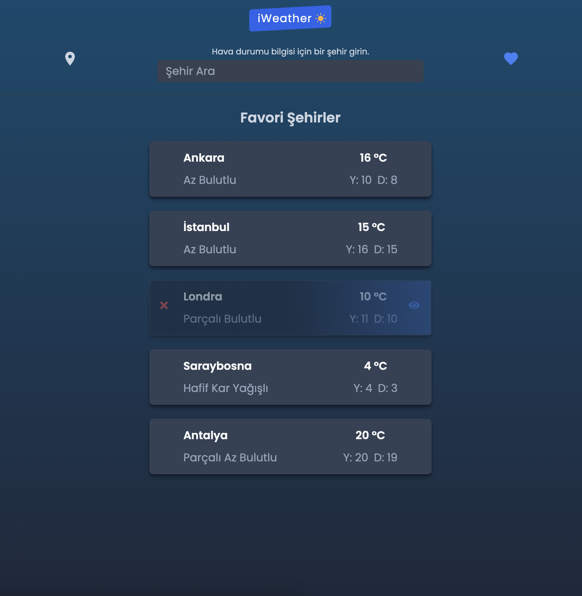
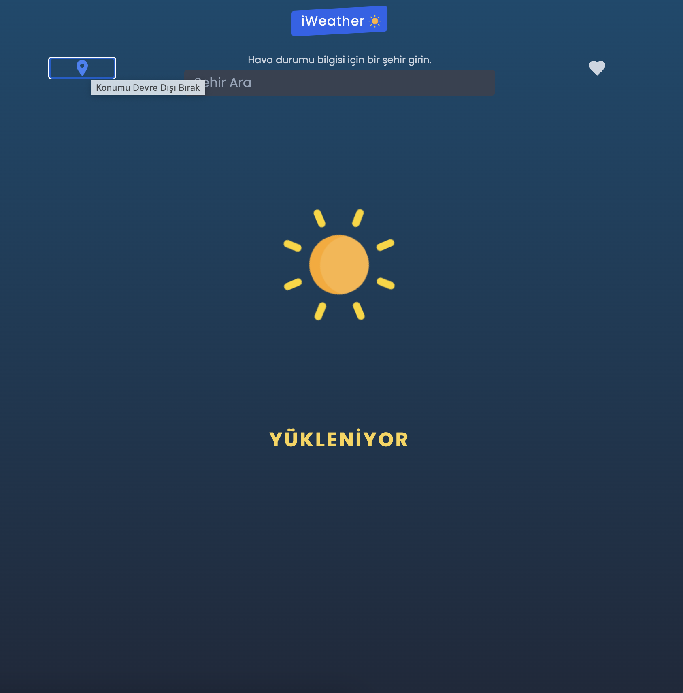
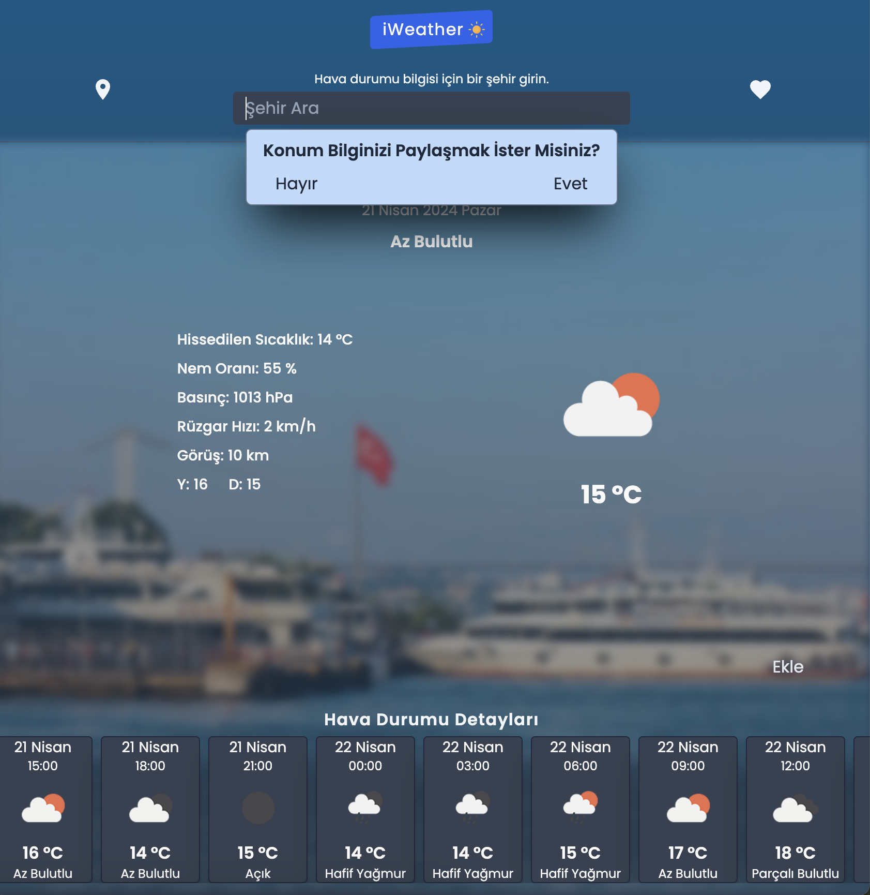

## 🔅 WEATHER APP - REACT2024

+ Bu uygulama kullanıcıların anlık olarak kendi lokasyonlarının hava durumunu alabildikleri gibi dünya genelinde istedikleri şehrin hava durumunu ve tüm detayları görüntülemelerine olanak sağlar.
+ Bir şehrin o anki hava durumunu görüntüleme imkanı sunulduğu gibi üçer saat ara ile o şehirdeki yaklaşık üç günlük hava değişimini de uygulamadan takip edebilirler.
+ Ayrıca takip etmek istedikleri 5 şehiri favori listelerine ekleyerek kolayca anlık olarak birden fazla şehrin hava durumunu görüntüleyebilirler.
+ Daha sonra bu listedeki şehirleri diledikleri gibi silebilir ya da o şehirleri detaylı görüntüleyebilirler.
+ Uygulamada lokasyon paylaşımı tamamen kullanıcının kendi isteğine bağlı olarak ayarlanmıştır. 
+ Eğer kullanıcı konumunun paylaşılmasını istemezse şehirleri arayarak görüntüler ve uygulamayı bu şekilde kullanır.
+ Eğer konumu paylaştıktan sonra lokasyon özelliğini kapatmak isterse de uygulamada bunu dinamik olarak her an gerçekleştirebilir.
+ Uygulama kullanıcı dostu arayüz tasarımı, duyarlılık(responsive), performans odaklı geliştirilmiştir.

<p align="center">
  
  
</p>
<p align="center">
  
  
</p>
  
## 💎 Projeyi Buradan Görüntüleyebilirsiniz
 - [Live Demo](https://busratugul-weather-app.netlify.app/)

## 💻 Kullanılan Teknolojiler
- ReactJS
- Axios 
- Tailwind
- React Icons

## 🌍 Kullanılan API'lar
- [OpenWeather](https://openweathermap.org/api)
- [Unsplash](https://unsplash.com/developers)
- [Geolocation](https://www.geolocation.com/ip-geolocation-api)


## ⚙️ Proje Kurulumu
**İlk olarak iWeather'ı clonelamak için :**
 ``` git clone https://github.com/busratugul/weather_app.git ```

**Proje dizinine gidin :**
```cd weather_app```

**Proje Bağımlılıklarını Yükleyin:**
```npm install```

**Artık projeyi çalıştırabilirsiniz :**
```npm start```

